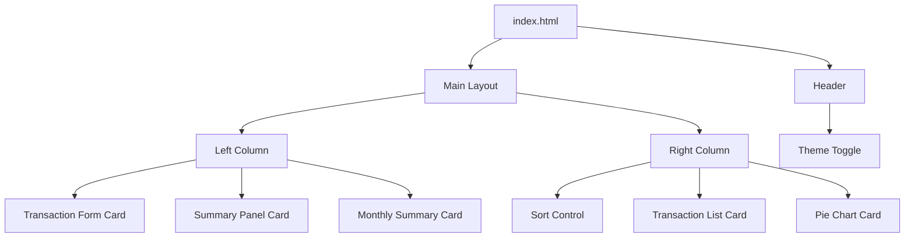

# Design Document: Spendly – Expense & Budget Visualizer

## Overview

Spendly adalah aplikasi web pencatat pengeluaran yang berjalan sepenuhnya di sisi client (browser). Tidak ada server, tidak ada framework — hanya HTML, CSS, dan Vanilla JavaScript murni.

Arsitektur aplikasi mengikuti pola **single-page application sederhana** berbasis DOM manipulation: state tersimpan di memory (array JavaScript) dan disinkronkan ke Local Storage setiap kali ada perubahan. Rendering dilakukan dengan cara menulis ulang bagian-bagian DOM yang relevan setiap kali state berubah.

Lingkup fitur:
- Pencatatan transaksi pengeluaran (tambah + hapus)
- Visualisasi distribusi per kategori (pie chart)
- Ringkasan bulanan otomatis
- Pengurutan daftar transaksi
- Dark/light mode dengan persistensi preferensi
- Persistensi data via Local Storage

---

## Architecture

### Prinsip Desain

1. **Single source of truth** — satu array `transactions` di memory menjadi acuan seluruh tampilan
2. **Render on change** — setiap mutasi state memanggil fungsi render yang memperbarui DOM secara langsung
3. **Sync to storage** — setiap mutasi state juga memanggil fungsi `saveToStorage()` sebelum render
4. **No dependencies** — seluruh logika ditulis tanpa library eksternal kecuali untuk rendering pie chart (Canvas API bawaan browser)

### Alur Data

```
User Action
    │
    ▼
Event Handler (js/app.js)
    │
    ├─► Validate Input
    │       │ (jika valid)
    │       ▼
    ├─► Mutate State (transactions array)
    │
    ├─► saveToStorage()   ──► Local Storage
    │
    └─► render()
            ├─► renderTransactionList()
            ├─► renderSummaryPanel()
            ├─► renderPieChart()
            └─► renderMonthlySummary()
```

### File Structure

```
CodingCamp-28Sept26-namira/
│
├── index.html          ← Satu-satunya halaman HTML
├── css/
│   └── style.css       ← Satu file CSS (wajib sesuai requirement 10.5)
└── js/
    └── app.js          ← Satu file JavaScript (wajib sesuai requirement 10.5)
```

### Diagram Komponen



---

## Components and Interfaces

### 1. Header

- Logo/judul "Spendly"
- Theme Toggle button (ikon matahari/bulan)
- Sticky di atas layar

### 2. Transaction Form Card

Field-field yang tersedia:
- Input teks `#input-name` — nama pengeluaran (maxlength="100")
- Input number `#input-amount` — nominal (min="0.01", max="999999999.99", step="0.01")
- Select `#select-category` — dropdown dengan 3 pilihan: Food, Transport, Fun
- Tombol `#btn-add` — tombol submit

Error display: setiap field punya elemen `<span class="error-msg">` tepat di bawahnya yang ditampilkan/disembunyikan secara dinamis.

### 3. Summary Panel Card

- Teks total pengeluaran `#total-display` — format Rupiah (Rp1.500.000)
- Diperbarui otomatis setiap kali ada mutasi pada `transactions`

### 4. Transaction List Card

- Sort Control (`#sort-control`) — radio buttons atau select untuk memilih urutan tampilan
- Container list `#transaction-list` — berisi item-item transaksi yang di-render secara dinamis
- Setiap item transaksi memuat: nama, nominal (format Rupiah), kategori, tanggal, dan tombol hapus
- Pesan kosong `#empty-msg` ditampilkan ketika `transactions.length === 0`

### 5. Pie Chart Card

- Elemen `<canvas id="pie-chart">` untuk rendering chart
- Legenda `#chart-legend` di bawah canvas — daftar nama kategori + persentase
- Pesan kosong `#chart-empty-msg` ditampilkan ketika tidak ada data

### 6. Monthly Summary Card

- Container `#monthly-summary` — berisi grup-grup bulan
- Setiap grup bulan menampilkan: label "Bulan Tahun" + total pengeluaran bulan itu
- Diurutkan dari bulan terbaru ke terlama
- Bulan tanpa transaksi tidak ditampilkan

### 7. Confirmation Dialog

- Elemen `<dialog id="confirm-dialog">` (HTML native dialog element)
- Pesan konfirmasi teks
- Tombol "Hapus" (`#btn-confirm-delete`) dan "Batal" (`#btn-cancel-delete`)
- Menyimpan ID transaksi yang akan dihapus di atribut `data-pending-id`

### 8. Theme Toggle

- Button `#theme-toggle` di header
- Menambah/menghapus class `dark` pada `<html>` element
- Ikon berubah sesuai tema aktif

---

## Data Models

### Transaction Object

```javascript
{
  id: string,          // UUID v4 yang di-generate saat transaksi dibuat
                       // Format: "xxxxxxxx-xxxx-4xxx-yxxx-xxxxxxxxxxxx"
  description: string, // Nama pengeluaran (1–100 karakter, tidak boleh kosong)
  amount: number,      // Nominal pengeluaran (0.01 – 999999999.99)
  category: string,    // Salah satu dari: "Food" | "Transport" | "Fun"
  date: string         // ISO 8601 timestamp zona waktu lokal saat transaksi dibuat
                       // Format: "2024-01-15T10:30:00.000+07:00"
}
```

**Contoh:**
```javascript
{
  id: "a3f8c2d1-1234-4abc-8xyz-000000000001",
  description: "Makan siang di warteg",
  amount: 15000,
  category: "Food",
  date: "2024-07-25T12:34:56.789+07:00"
}
```

### Local Storage Schema

```
Key:   "spendly_transactions"
Value: JSON string dari array Transaction[]

Contoh:
[
  { "id": "...", "description": "...", "amount": 15000, "category": "Food", "date": "..." },
  { "id": "...", "description": "...", "amount": 50000, "category": "Transport", "date": "..." }
]

Key:   "spendly_theme"
Value: "dark" | "light"
```

Tidak ada key lain yang digunakan di Local Storage untuk menghindari konflik.

### Application State

```javascript
// State utama di app.js (module-level variables)
let transactions = [];   // Array of Transaction objects (single source of truth)
let currentSort = 'date-desc';  // Opsi sort aktif: 'date-desc' | 'amount-asc' | 'amount-desc' | 'category-asc'
let pendingDeleteId = null;     // ID transaksi yang sedang menunggu konfirmasi hapus
```

### Sort Options

| Value | Label | Logika |
|---|---|---|
| `date-desc` | Terbaru (default) | Sort by `date` descending |
| `amount-asc` | Nominal: Kecil ke Besar | Sort by `amount` ascending |
| `amount-desc` | Nominal: Besar ke Kecil | Sort by `amount` descending |
| `category-asc` | Kategori: A ke Z | Sort by `category` ascending alphabetical |

### Category Configuration

```javascript
const CATEGORIES = ["Food", "Transport", "Fun"];

// Warna per kategori untuk pie chart (unik, tidak ada dua warna bersebelahan yang sama)
const CATEGORY_COLORS = {
  "Food":       "#FF6B6B",   // Merah coral
  "Transport":  "#4ECDC4",   // Teal
  "Fun":        "#FFE66D"    // Kuning
};
```

---

## UI Layout

### Desktop Layout (≥ 768px)

```
┌─────────────────────────────────────────────────────────┐
│  🌙 Spendly – Expense Tracker              [☀️ Toggle]  │  ← Header (sticky)
├──────────────────────┬──────────────────────────────────┤
│                      │                                   │
│  [Transaction Form]  │  Sort: [Terbaru ▼]               │
│                      │                                   │
│  [Summary Panel]     │  ┌─────────────────────────────┐ │
│                      │  │ nama    Rp15.000  Food      🗑 │ │
│  [Monthly Summary]   │  │ nama    Rp50.000  Transport 🗑 │ │
│                      │  └─────────────────────────────┘ │
│                      │                                   │
│                      │  [Pie Chart + Legend]             │
│                      │                                   │
└──────────────────────┴──────────────────────────────────┘
```

### Mobile Layout (< 768px)

Kolom kiri dan kanan ditumpuk secara vertikal. Urutan dari atas ke bawah:
1. Header
2. Transaction Form Card
3. Summary Panel Card
4. Sort Control + Transaction List Card
5. Pie Chart Card
6. Monthly Summary Card

### Dark/Light Mode

Implementasi menggunakan **CSS Custom Properties** (CSS variables). Class `dark` ditambahkan pada elemen `<html>`:

```css
/* Light mode (default) */
:root {
  --bg-primary:     #F8F9FA;
  --bg-card:        #FFFFFF;
  --text-primary:   #212529;
  --text-secondary: #6C757D;
  --accent:         #6C63FF;
  --border:         #DEE2E6;
  --shadow:         rgba(0,0,0,0.08);
}

/* Dark mode */
html.dark {
  --bg-primary:     #1A1A2E;
  --bg-card:        #16213E;
  --text-primary:   #E9ECEF;
  --text-secondary: #ADB5BD;
  --accent:         #A78BFA;
  --border:         #2D3748;
  --shadow:         rgba(0,0,0,0.3);
}
```

Semua elemen CSS menggunakan variabel ini — penggantian tema terjadi hanya dengan menambah/menghapus satu class, tanpa perlu menulis ulang rules.

Transisi tema menggunakan:
```css
body { transition: background-color 150ms ease, color 150ms ease; }
```

---

## Pie Chart Implementation

Pie chart dirender menggunakan **Canvas API bawaan browser** — tidak menggunakan library eksternal.

### Algoritma Rendering

```
1. Hitung total keseluruhan amount dari semua transactions
2. Untuk setiap kategori yang ada datanya:
   a. Hitung persentase = (total_kategori / total_keseluruhan) * 100
   b. Hitung sudut slice = (total_kategori / total_keseluruhan) * 2π radian
3. Gambar setiap slice dengan ctx.arc() menggunakan warna dari CATEGORY_COLORS
4. Gambar legenda di bawah canvas (kategori + persentase dibulatkan 1 desimal)
5. Jika tidak ada data, sembunyikan canvas dan tampilkan pesan kosong
```

### Fungsi Inti

```javascript
function renderPieChart() {
  const canvas = document.getElementById('pie-chart');
  const ctx = canvas.getContext('2d');
  ctx.clearRect(0, 0, canvas.width, canvas.height);

  // Agregasi per kategori
  const totals = aggregateByCategory(transactions); // returns {Food: 50000, ...}
  const grandTotal = Object.values(totals).reduce((a, b) => a + b, 0);

  if (grandTotal === 0) { /* tampilkan empty state */ return; }

  let startAngle = -Math.PI / 2; // mulai dari atas (12 o'clock)
  for (const [cat, total] of Object.entries(totals)) {
    const sliceAngle = (total / grandTotal) * 2 * Math.PI;
    ctx.beginPath();
    ctx.moveTo(cx, cy);
    ctx.arc(cx, cy, radius, startAngle, startAngle + sliceAngle);
    ctx.fillStyle = CATEGORY_COLORS[cat];
    ctx.fill();
    startAngle += sliceAngle;
  }
  renderLegend(totals, grandTotal);
}
```

---

## State Management

### Mutation Pattern

Semua mutasi mengikuti pola yang sama agar konsisten:

```javascript
// Contoh: addTransaction
function addTransaction(description, amount, category) {
  const tx = {
    id: generateUUID(),
    description,
    amount,
    category,
    date: new Date().toISOString()
  };
  transactions.push(tx);          // 1. mutasi state
  saveToStorage();                 // 2. sync ke storage
  renderAll();                     // 3. perbarui semua tampilan
}

// Contoh: deleteTransaction
function deleteTransaction(id) {
  transactions = transactions.filter(tx => tx.id !== id);  // 1. mutasi state
  saveToStorage();                                          // 2. sync ke storage
  renderAll();                                              // 3. perbarui semua tampilan
}
```

### renderAll()

```javascript
function renderAll() {
  renderTransactionList();   // daftar + sort
  renderSummaryPanel();      // total
  renderPieChart();          // chart + legenda
  renderMonthlySummary();    // ringkasan bulanan
}
```

### Local Storage Functions

```javascript
function saveToStorage() {
  try {
    localStorage.setItem('spendly_transactions', JSON.stringify(transactions));
  } catch (e) {
    showError('Data tidak dapat disimpan. Local Storage mungkin penuh.');
  }
}

function loadFromStorage() {
  try {
    const raw = localStorage.getItem('spendly_transactions');
    if (!raw) return [];
    const parsed = JSON.parse(raw);
    return Array.isArray(parsed) ? parsed : [];
  } catch (e) {
    localStorage.removeItem('spendly_transactions');
    showError('Data tersimpan tidak dapat dimuat dan telah dihapus.');
    return [];
  }
}
```

---

## Error Handling

| Skenario | Penanganan |
|---|---|
| Field nama kosong saat submit | Tampilkan error di bawah field; jangan tambah transaksi |
| Nominal kosong / 0 / negatif / terlalu besar | Tampilkan error di bawah field; jangan tambah transaksi |
| Kategori belum dipilih | Tampilkan error di bawah dropdown; jangan tambah transaksi |
| Local Storage penuh saat save | Tampilkan notifikasi error di atas halaman; data tetap di memory selama sesi |
| Data di Local Storage corrupt (bukan JSON valid) | Hapus key dari storage, inisialisasi state kosong, tampilkan pesan error |
| Storage tidak tersedia (misal: mode private di Safari lama) | Tangkap exception di `saveToStorage()` / `loadFromStorage()`, tampilkan error, lanjutkan tanpa persistensi |

Error messages ditampilkan melalui:
1. **Field-level errors** — `<span class="error-msg">` di bawah setiap input
2. **Global toast/banner** — elemen `#global-error` di bagian atas untuk storage errors

---

## Testing Strategy

Aplikasi diuji secara manual melalui browser. Tidak ada test runner atau library eksternal yang digunakan.

Skenario yang perlu diverifikasi secara manual:
- Alur penuh tambah → tampil di list → tampil di chart → tampil di monthly summary
- Persistensi: tambah transaksi → refresh → data tetap ada
- Dark mode: toggle → refresh → tema tetap tersimpan
- Corrupt data: inject data rusak ke localStorage → reload → app recovery gracefully
- Validasi form: coba submit dengan field kosong, nominal negatif, kategori belum dipilih
- Hapus transaksi: klik hapus → dialog konfirmasi → konfirmasi → transaksi hilang
- Sort: ganti urutan → list berubah sesuai pilihan
